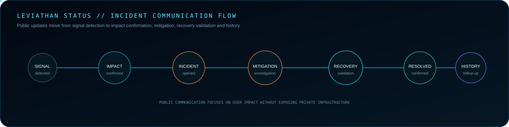
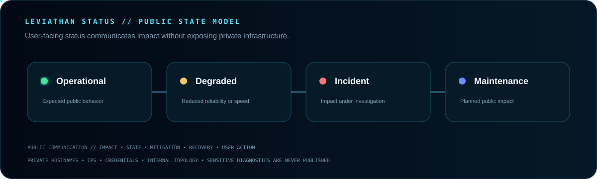

 

**Public service availability, maintenance and incident information for intentionally exposed Leviathan services.**

[Guide](GUIDE.md) · [Launcher](https://github.com/Lapinite/Leviathan-Launcher) · [Docs](https://github.com/Lapinite/Leviathan-Docs) · [API Docs](https://github.com/Lapinite/Leviathan-API-Docs) · [Security](SECURITY.md)

## Incident lifecycle

## Public state model

## Status rules

Public status focuses on user impact, affected public components, current state, mitigation, recovery and required user action.

Private hostnames, IPs, credentials, internal topology, administrative endpoints, provider account identifiers, database details and security-sensitive implementation information stay private.

Third-party Microsoft, Xbox, Minecraft/Mojang and other external dependencies may be identified by category when they affect users.

## Current status

The public status system is being prepared. Components will appear when they are intentionally exposed and monitored publicly.

## Network

[Launcher](https://github.com/Lapinite/Leviathan-Launcher) · [Docs](https://github.com/Lapinite/Leviathan-Docs) · [API Docs](https://github.com/Lapinite/Leviathan-API-Docs) · [Integrations](https://github.com/Lapinite/Leviathan-Integrations) · [Server Tools](https://github.com/Lapinite/Leviathan-Server-Tools)
