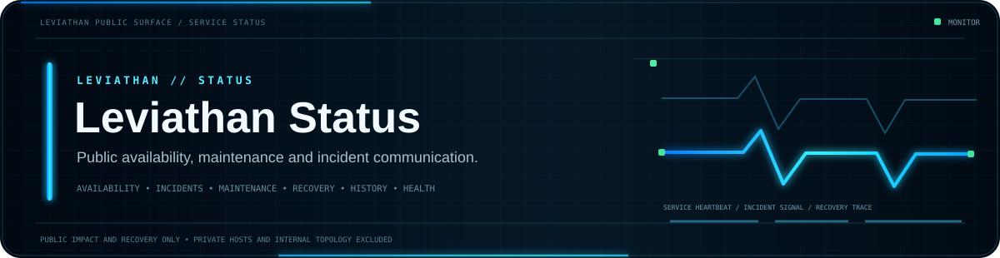

<div align="center">



<br>


**Public service availability, maintenance and incident information for intentionally exposed Leviathan services.**

[Guide](GUIDE.md) · [Launcher](https://github.com/Lapinite/Leviathan-Launcher) · [Docs](https://github.com/Lapinite/Leviathan-Docs) · [API Docs](https://github.com/Lapinite/Leviathan-API-Docs) · [Security](SECURITY.md)

</div>

## Status model

<table width="100%">
<tr>
<td width="25%" valign="top"><strong>Operational</strong><br><sub>Public component is functioning within expected conditions</sub></td>
<td width="25%" valign="top"><strong>Degraded</strong><br><sub>Service is available but experiencing reduced reliability or performance</sub></td>
<td width="25%" valign="top"><strong>Incident</strong><br><sub>Public user impact is under investigation or mitigation</sub></td>
<td width="25%" valign="top"><strong>Maintenance</strong><br><sub>Planned maintenance with public-facing impact</sub></td>
</tr>
</table>

## Purpose

This repository is intended to provide public information about:

- service availability
- degraded performance
- scheduled maintenance
- public incidents
- recovery updates
- incident history

Only public-facing components should be named here.

## Incident communication flow

```text
Signal detected
      ↓
Public impact confirmed
      ↓
Incident opened
      ↓
Investigation / mitigation
      ↓
Recovery validation
      ↓
Resolved
      ↓
Public history / follow-up when useful
```

Status communication should prioritize what users and developers need to know: affected public components, user impact, current state, mitigation progress, recovery, and any required user action.

## Privacy and infrastructure safety

Status information must not expose private hostnames, private IP addresses, credentials, internal topology, administrative endpoints, provider account identifiers, personal information, database details, or security-sensitive implementation information.

Incident reports should explain user impact and resolution at a useful public level without publishing details that create unnecessary security risk.

## Publication principles

A public status update should be:

- accurate
- timestamped
- scoped to user-facing impact
- clear about whether an incident is ongoing or resolved
- free from speculation presented as fact
- safe to publish without exposing private infrastructure

## Current status

The public status system is being prepared as the Leviathan platform develops. Service components will be listed when they are intentionally made available and monitored publicly.

The absence of a listed public component should not be interpreted as proof that an internal system does or does not exist.

## Related repositories

| Repository | Role |
| --- | --- |
| [Leviathan Launcher](https://github.com/Lapinite/Leviathan-Launcher) | Public launcher information |
| [Leviathan Docs](https://github.com/Lapinite/Leviathan-Docs) | Ecosystem documentation |
| [Leviathan API Docs](https://github.com/Lapinite/Leviathan-API-Docs) | Public API documentation |
| [Leviathan Integrations](https://github.com/Lapinite/Leviathan-Integrations) | Supported public integrations |
| [Leviathan Server Tools](https://github.com/Lapinite/Leviathan-Server-Tools) | Public server tooling |
